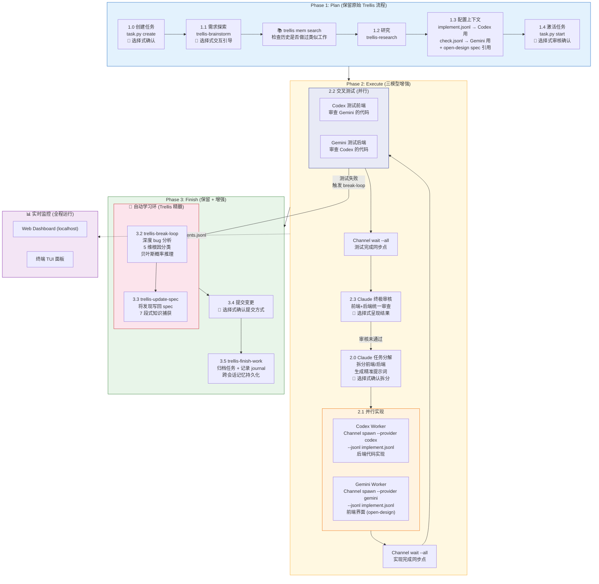
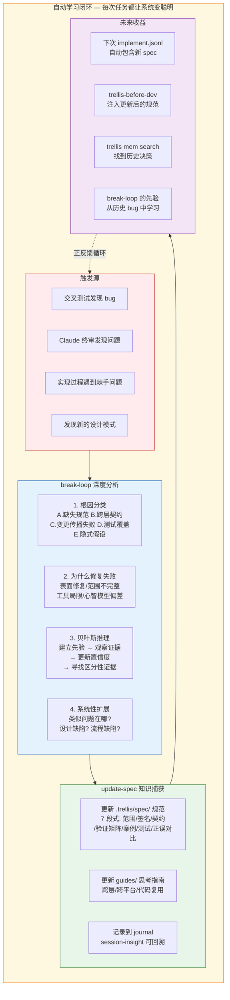
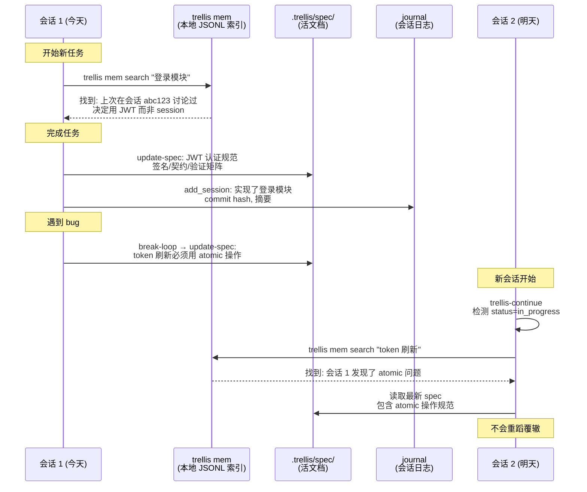
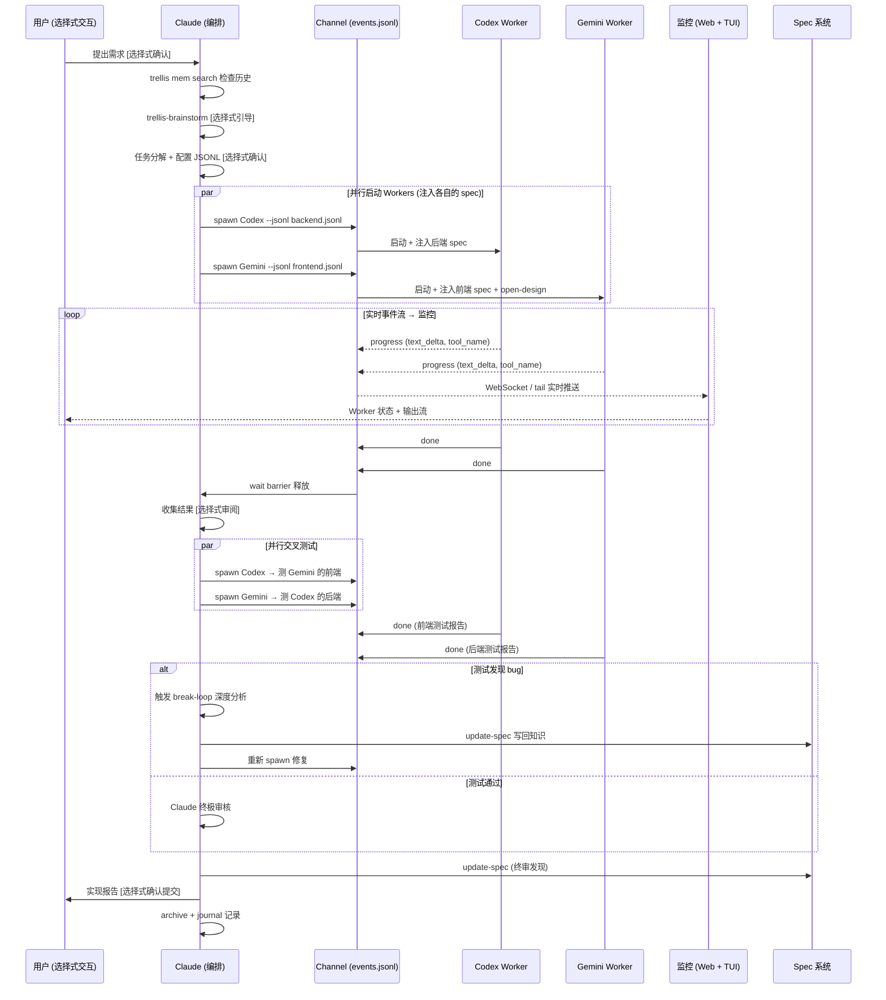
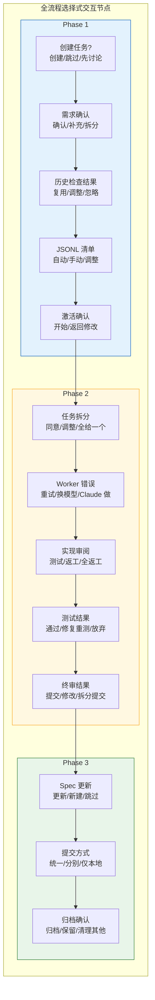
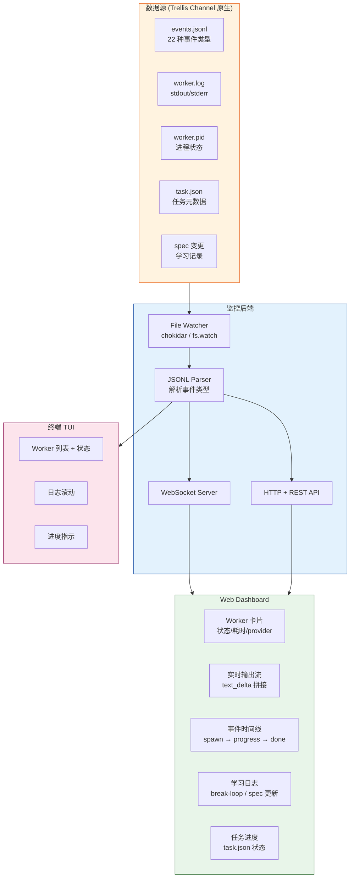
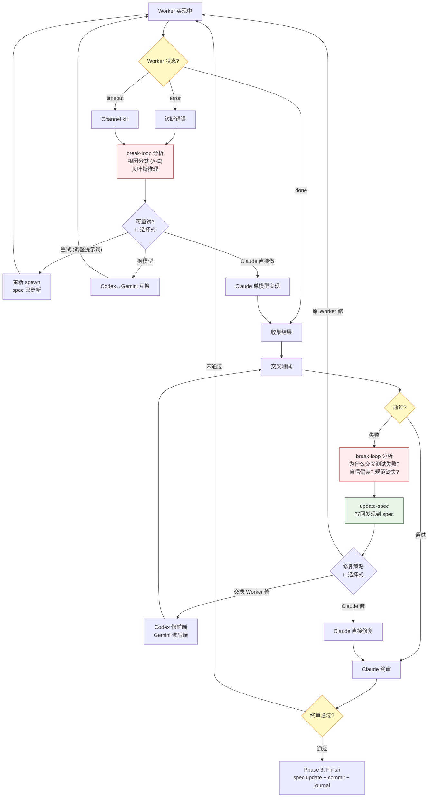

# Trellis 三模型协作工作流 - 完整流程图

> Claude (编排) + Codex (后端) + Gemini (前端) 融合工作流
> 基于 Trellis v0.6.4 Channel 系统 · 保留 Trellis 全部核心思想

---

## 零、Trellis 核心思想清单 (不可删改)

| # | 思想 | 机制 | 融合方式 |
|---|------|------|----------|
| 1 | **先规划后编码** | Plan → Execute → Finish 三阶段门禁 | Phase 1 完全保留，新流程只增强 Phase 2 |
| 2 | **知识注入而非记忆** | JSONL 清单 + Spec 系统注入上下文 | Codex/Gemini worker 通过 `--jsonl` 注入 spec |
| 3 | **自动学习** | break-loop 分析 bug → update-spec 写入规范 | 交叉测试失败时自动触发 break-loop |
| 4 | **跨会话记忆** | `trellis mem` 搜索历史对话 | 规划阶段调 mem 检查"上次怎么解的" |
| 5 | **会话持久化** | journal 记录 + session-insight 回溯 | 每次协作完成后自动记录 journal |
| 6 | **Spec 是活文档** | 每次任务后 update-spec 捕获新知识 | Claude 终审发现的模式写回 spec |
| 7 | **上下文精准投递** | implement.jsonl / check.jsonl 清单 | 每个 worker 只拿到自己需要的 spec |
| 8 | **贝叶斯调试** | break-loop 中的概率推理框架 | 交叉测试 bug 用贝叶斯定位根因 |
| 9 | **Session 续接** | trellis-continue 恢复工作点 | 中断后自动定位到正确 phase/step |
| 10 | **安全更新** | template-hash 防覆盖用户修改 | 新增模块不破坏现有配置 |

---

## 一、完整生命周期总览

---

## 二、自动学习闭环 (Trellis 最核心的价值)

---

## 三、跨会话记忆 & 会话续接

---

## 四、三模型协作中的 Trellis 机制映射

```mermaid
flowchart TB
    subgraph ORCHESTRATION["Claude 编排 — Trellis 机制在每个环节的作用"]

        subgraph PLAN_STAGE["规划阶段"]
            brainstorm["trellis-brainstorm<br/>选择式需求引导"]
            mem_prior["trellis mem<br/>查历史: 做过类似的吗?"]
            jsonl_curate["配置 JSONL 清单<br/>Codex 的 / Gemini 的 分开配"]
        end

        subgraph DISPATCH["分发阶段"]
            spawn_cx["Channel spawn Codex<br/>--jsonl backend-implement.jsonl<br/>注入后端 spec"]
            spawn_gx["Channel spawn Gemini<br/>--jsonl frontend-implement.jsonl<br/>注入前端 spec + open-design"]
            context_inject["trellis-before-dev<br/>每个 worker 按 spec 索引<br/>加载对应包的规范"]
        end

        subgraph TEST_STAGE["测试阶段"]
            cross_test["交叉测试<br/>Codex 不测自己的代码<br/>Gemini 不测自己的代码"]
            test_fail{"测试失败?"}
            break_loop_trigger["自动触发 break-loop<br/>5 维分析 + 贝叶斯推理<br/>找到真正根因"]
        end

        subgraph REVIEW_STAGE["审核阶段"]
            claude_final["Claude 终极审核<br/>前后端一致性检查<br/>跨层契约验证"]
            spec_update["update-spec<br/>发现的模式/契约/陷阱<br/>写回 spec 活文档"]
        end

        subgraph WRAP["收尾阶段"]
            commit_select["选择式确认提交<br/>前后端分别提交 / 统一提交"]
            archive["task.py archive<br/>任务归档"]
            journal_record["add_session.py<br/>记录会话到 journal"]
            mem_persist["知识持久化<br/>下次 trellis mem 可搜到"]
        end

        PLAN_STAGE --> DISPATCH --> TEST_STAGE
        test_fail -->|是| break_loop_trigger
        break_loop_trigger --> spec_update
        test_fail -->|否| REVIEW_STAGE
        TEST_STAGE --> REVIEW_STAGE
        REVIEW_STAGE --> WRAP
        spec_update -.->|"下次任务受益"| PLAN_STAGE
    end

    style PLAN_STAGE fill:#e3f2fd,stroke:#1565c0
    style DISPATCH fill:#fff3e0,stroke:#ef6c00
    style TEST_STAGE fill:#fce4ec,stroke:#c62828
    style REVIEW_STAGE fill:#e8eaf6,stroke:#283593
    style WRAP fill:#e8f5e9,stroke:#2e7d32
```

---

## 五、Channel 事件流 & 监控数据流

---

## 六、选择式交互 × Trellis 决策点

---

## 七、监控面板架构

---

## 八、错误处理 + 自动学习回滚流程

---

## 九、Trellis 思想 × 新流程 对照表

| Trellis 原始能力 | 原始触发时机 | 融合后增强触发 |
|-----------------|-------------|---------------|
| **trellis-brainstorm** | 用户提出新需求 | + Claude 分解前后端需求时也用 |
| **trellis mem** | 用户问"上次怎么做的" | + 规划阶段自动检查历史 |
| **implement.jsonl** | 给单个 implement 代理 | + 拆分为 backend.jsonl / frontend.jsonl 分别投递 |
| **trellis-before-dev** | 实现前加载 spec | + 每个 Worker spawn 前注入对应包的 spec |
| **trellis-check** | 单代理检查 | + 交叉测试 (异模型检查) |
| **break-loop** | 手动触发 / 调试后 | + 交叉测试失败时自动触发 |
| **update-spec** | 任务完成时 | + 交叉测试发现问题时即时写回 + 终审后写回 |
| **session-insight** | 用户问"之前讨论过吗" | + 新任务开始前自动检查 |
| **trellis-continue** | 会话恢复 | + 三模型协作中断后恢复到正确步骤 |
| **finish-work** | 手动收尾 | + 自动: archive + journal + spec 更新 |
| **Channel** | 多代理协作 | = 核心调度层 (spawn/wait/event) |
| **Forum channel** | 议题讨论 | + 跨模型审查意见持久化 |
| **Worker OOM guard** | 防止资源耗尽 | = 保持不变 (idle 5m, max 6) |
| **template-hash** | 安全更新 | = 新模块不覆盖用户自定义 |
